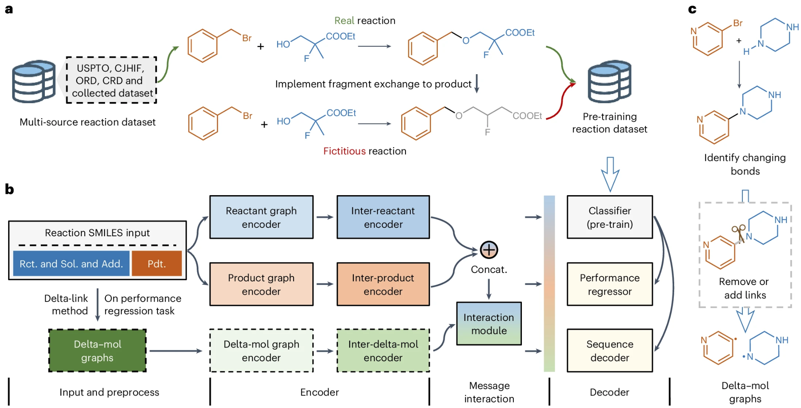

# RXNGraphormer

[](https://ubuntu.com/) [](https://www.python.org/) [](https://pytorch.org/) [](https://pytorch-geometric.readthedocs.io/) [](https://www.rdkit.org/) [](https://opensource.org/licenses/MIT)

Official implementation of *"A unified pre-trained deep learning framework for cross-task reaction performance prediction and synthesis planning"*. Here, we provide a [wiki document](https://deepwiki.com/licheng-xu-echo/RXNGraphormer), which was auto-generated by DeepWiki based on latest commit. The correpsonding paper is available at [*Nature Machine Intelligence*](https://www.nature.com/articles/s42256-025-01098-4). Preprint is available at [*ResearchSquare*](https://www.researchsquare.com/article/rs-5994908/v1).


## Pytorch 2 support
We have added support for PyTorch 2+ to the RXNGraphormer project. The current testing environment includes Python 3.10 and PyTorch 2.2.1. During environment setup, we identified and addressed several potential code conflicts:
​​
- The current code relies on localmapper(a dependency for calculating delta-mol) which depends on DGL. However, the version of DGL (2.1.0) automatically installed with localmapperdoes not support NumPy 2+. Consequently, we have pinned the NumPy version to the latest release in the 1.x series.

- Due to interface naming constraints within RXNGraphormer, we have fixed the OpenNMT-py version to 1.2.0.

- Newer versions of RDKit have introduced changes in SMILES processing strategies. To ensure correct processing of the 6.8 million pre-training reaction data samples, we have pinned the RDKit version to 2024.3.2.

We plan to resolve the NumPy version restriction and upgrade to NumPy 2+ in the future.

## 📌 Key Features

- **Unified Architecture**: Integrates graph neural networks with Transformer to capture both intra and inter-molecular information.
- **Pre-trained Model**: A pre-trained model that learns chemical bond transformation patterns from 13 million reactions.
- **Cross-task Reaction Prediction**: Simultaneous handling of:
  - Yield, regioselectivity and enantioselectivity estimation (regression)
  - Forward- and retro-synthesis planning (sequence generation)
- **Performance**: RXNGraphormer achieves state-of-the-art performance across eight benchmark datasets for reactivity/selectivity prediction and forward-/retro-synthesis planning, as well as three external realistic datasets for reactivity and selectivity prediction.

## 🚀 Quick Start

### Installation

```bash
conda create -n rxngraphormer python=3.10
conda activate rxngraphormer
git clone -b pytorch2 https://github.com/licheng-xu-echo/RXNGraphormer.git
cd RXNGraphormer/

# option 1: install based on requirements
pip install -r requirements_pt221.txt -f https://data.pyg.org/whl/torch-2.2.0+cu121.html --extra-index-url https://download.pytorch.org/whl/cu121
pip install .

# option 2: Install important package one by one to avoid fixing the versions of all the packages.
pip install torch==2.2.1 --index-url https://download.pytorch.org/whl/cu121
pip install pyg_lib torch_scatter torch_sparse torch_cluster torch_spline_conv -f https://data.pyg.org/whl/torch-2.2.0+cu121.html
pip install rdkit==2024.3.2 ipykernel pandas python-box OpenNMT-py==1.2.0 torchdata==0.7.1 torch_geometric rxnmapper localmapper transformers==4.30.0 numpy==1.26.4 scikit-learn
pip install .
```

**Note:** All codes were tested under Ubuntu 22.04.4 LTS

### Download model weights and dataset

All model weights and preprocessed datasets are available via our [figshare repository](https://doi.org/10.6084/m9.figshare.28356077). Please put these files in `model_path` and `dataset` folders, like the following structure:

```
RXNGraphormer
|── rxngraphormer
├── model_path
│   ├── buchwald_hartwig/
|   ├── C_H_func/
|   ├── pretrained_classification_model/
|   ├── suzuki_miyaura/
│   ├── thiol_addition/
|   ├── USPTO_50k/
|   ├── USPTO_480k/
|   └── ...
|── dataset
│   ├── 50k_with_rxn_type/
|   ├── external_validation_dataset/
│   ├── OOS/
│   ├── pretrain/
│   ├── USPTO_50k/
│   ├── USPTO_480k/
│   ├── USPTO_full/
│   └── ...
|── ...
```

### Basic Usage

**Reaction performance prediction**

```python3
from rxngraphormer.eval import reaction_prediction
# reactivity prediction
bh_model_path = "./model_path/buchwald_hartwig/seed0"
rxn_smiles_lst = ["CC(C)c1cc(C(C)C)c(-c2ccccc2P(C2CCCCC2)C2CCCCC2)c(C(C)C)c1.CN(C)C(=NC(C)(C)C)N(C)C.Cc1ccc(N)cc1.FC(F)(F)c1ccc(I)cc1.c1ccc(-c2ccon2)cc1>>Cc1ccc(Nc2ccc(C(F)(F)F)cc2)cc1",
                  "CC(C)c1cc(C(C)C)c(-c2ccccc2P(C2CCCCC2)C2CCCCC2)c(C(C)C)c1.CCOC(=O)c1cc(C)on1.CN(C)C(=NC(C)(C)C)N(C)C.Cc1ccc(N)cc1.FC(F)(F)c1ccc(Cl)cc1>>Cc1ccc(Nc2ccc(C(F)(F)F)cc2)cc1"]
bh_react_preds = reaction_prediction(bh_model_path,rxn_smiles_lst,task_type="reactivity")

# selectivity prediction
thiol_add_model_path = "./model_path/thiol_addition/seed0"
rxn_smiles_lst = ["COCc1cccc(-c2cc3c(c4c2OP(=O)(O)Oc2c(-c5cccc(COC)c5)cc5c(c2-4)CCCC5)CCCC3)c1.O=C(/N=C/c1ccccc1)c1ccccc1.Sc1ccccc1>>O=C(NC(Sc1ccccc1)c1ccccc1)c1ccccc1",
                  "COCc1cccc(-c2cc3ccccc3c3c2OP(=O)(O)Oc2c(-c4cccc(COC)c4)cc4ccccc4c2-3)c1.O=C(/N=C/c1cccc2ccccc12)c1ccccc1.SC1CCCCC1>>O=C(NC(SC1CCCCC1)c1cccc2ccccc12)c1ccccc1"]
thiol_add_sel_preds = reaction_prediction(thiol_add_model_path,rxn_smiles_lst,task_type="selectivity")

# It takes about 25 seconds to predict 100 reactions on a single AMD 7735HS CPU without GPU.
```

**Reaction synthesis planning prediction**

```python3
from rxngraphormer.eval import reaction_prediction

# retro-synthesis planning
uspto_50k_model_path = "./model_path/USPTO_50k"
pdt_smiles_lst = ['COC(=O)[C@H](CCCCN)NC(=O)Nc1cc(OC)cc(C(C)(C)C)c1O',
                  'O=C(Nc1cccc2cnccc12)c1cc([N+](=O)[O-])c(Sc2c(Cl)cncc2Cl)s1',
                  'CCN(CC)Cc1ccc(-c2nc(C)c(COc3ccc([C@H](CC(=O)N4C(=O)OC[C@@H]4Cc4ccccc4)c4ccon4)cc3)s2)cc1']
rct_preds = reaction_prediction(uspto_50k_model_path, pdt_smiles_lst, task_type="retro-synthesis")

# forward-synthesis planning
uspto_480k_model_path = "./model_path/USPTO_480k"
rct_smiles_lst = ['C1CCOC1.CC(C)C[Mg+].CON(C)C(=O)c1ccc(O)nc1.[Cl-]',
                  'CN.O.O=C(O)c1ccc(Cl)c([N+](=O)[O-])c1',
                  'CCn1cc(C(=O)O)c(=O)c2cc(F)c(-c3ccc(N)cc3)cc21.O=CO']
pdt_preds = reaction_prediction(uspto_480k_model_path, rct_smiles_lst, task_type="forward-synthesis")

# It takes about 40 seconds to predict 100 reactions on a single AMD 7735HS CPU without GPU.
```

**Reaction embeddings generation**

```python3
from rxngraphormer.rxn_emb import RXNEMB

# base on pretrained model
pretrain_model_path = "./model_path/pretrained_classification_model"
rxnemb_calc_pretrained = RXNEMB(pretrained_model_path=pretrain_model_path,model_type="classifier")
rxn_emb_pretrained = rxnemb_calc_pretrained.gen_rxn_emb(["C1CCCCC1.CCO.CS(=O)(=O)N1CCN(Cc2ccccc2)CC1.[OH-].[OH-].[Pd+2]>>CS(=O)(=O)N1CCNCC1",
                                              "CCOC(C)=O.Cc1cc([N+](=O)[O-])ccc1NC(=O)c1ccccc1.Cl[Sn]Cl.O.O.O=C([O-])O.[Na+]>>Cc1cc(N)ccc1NC(=O)c1ccccc1",
                                              "COc1ccc(-c2coc3ccc(-c4nnc(S)o4)cc23)cc1.COc1ccc(CCl)cc1F>>COc1ccc(-c2coc3ccc(-c4nnc(SCc5ccc(OC)c(F)c5)o4)cc23)cc1"])

# base on finetuned model
finetune_model_path = "./model_path/buchwald_hartwig/seed0"
rxnemb_calc_finetuneed = RXNEMB(pretrained_model_path=finetune_model_path,model_type="regressor")
rxn_emb_finetuned = rxnemb_calc_finetuneed.gen_rxn_emb(["CC(C)c1cc(C(C)C)c(-c2ccccc2P(C2CCCCC2)C2CCCCC2)c(C(C)C)c1.CN(C)C(=NC(C)(C)C)N(C)C.Cc1ccc(N)cc1.FC(F)(F)c1ccc(I)cc1.c1ccc(-c2ccon2)cc1>>Cc1ccc(Nc2ccc(C(F)(F)F)cc2)cc1",
                                                        "CCN=P(N=P(N(C)C)(N(C)C)N(C)C)(N(C)C)N(C)C.COc1ccc(OC)c(P([C@]23C[C@H]4C[C@H](C[C@H](C4)C2)C3)[C@]23C[C@H]4C[C@H](C[C@H](C4)C2)C3)c1-c1c(C(C)C)cc(C(C)C)cc1C(C)C.Cc1ccc(N)cc1.Ic1cccnc1.c1ccc(-c2ccon2)cc1>>Cc1ccc(Nc2cccnc2)cc1",
                                                        "CC(C)c1cc(C(C)C)c(-c2ccccc2P(C2CCCCC2)C2CCCCC2)c(C(C)C)c1.CCc1ccc(I)cc1.CN1CCCN2CCCN=C12.Cc1ccc(N)cc1.c1ccc2oncc2c1>>CCc1ccc(Nc2ccc(C)cc2)cc1"])
```

## ⚛️ Model Training

Although the script automatically preprocesses the data when you start the model training program, we recommend that you perform data preprocessing separately to avoid errors when using multi-gpu training models. Multi-gpu is usually used for model pretraining and fine-tuning for reaction synthesis planning tasks.

In the pre-training task, multiple data sub-files are used to create training sets and validation sets. The `file_num_trunck` parameter in the json file can control how many sub-files are used. If it is set to `0`, all sub-files are used.

```bash
python data_preprocess.py --config_json ./config/pretrain_parameters.json                                                                         # preprocess pretraining data 
CUDA_VISIBLE_DEVICES="0,1" torchrun --nproc_per_node=2 train_model.py --config_json ./config/pretrain_parameters.json                             # pretrain model with multi-gpu
python train_model.py --config_json ./config/C_H_func_parameters.json                                                                             # finetune regression model
python train_model.py --config_json ./config/uspto_50k_parameters.json                                                                            # finetune sequence genration model
```

## 🔢 Evaluation

```bash
python eval_model.py --config_json ./config/buchwald_hartwig_eval.json    # evaluate regression model
python eval_model.py --config_json ./config/uspto_50k_eval.json           # evaluate sequence generation model
```

## 📑 Some results in paper

Here we provide a [notebook](https://github.com/licheng-xu-echo/RXNGraphormer/blob/main/notebook/demo.ipynb) to show how to generate fictitious reactions based on real reactions, how to generate delta-mol SMILES based on reaction SMILES, how to evaluate the regression performance of RXNGraphormer, use the embeddings generated by pre-trained RXNGraphormer to measure the distance between different reaction types in USPTO-50k, and use the embeddings generated by fine-tuned RXNGraphormer to examine the model's understanding of reaction structure-performance relationship.

## 📚 Citation

Please cite the following paper: Xu, LC., Tang, MJ., An, J. et al. A unified pre-trained deep learning framework for cross-task reaction performance prediction and synthesis planning. *Nat. Mach. Intell.* **2025**, *7*, 1561.

## Contact with us

If you have any questions, please contact us via email: xulicheng@sais.org.cn or lcxu1997@gmail.com.
